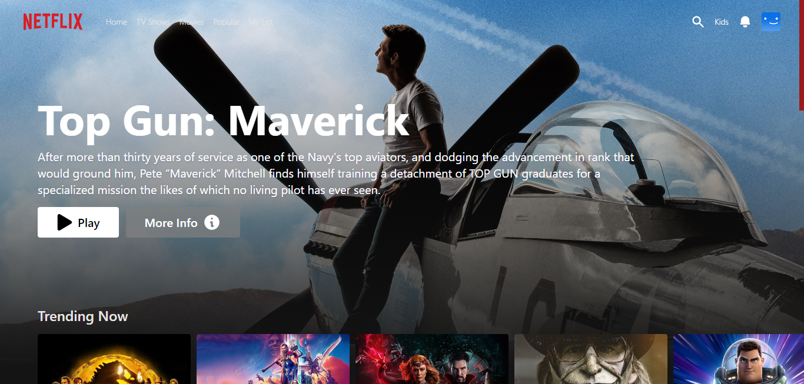

# Netflix Clone

This app looks similar to Netflix, which is the world's most famous OTT platform. 
Built for educational purposes only. Feel free to use dummy credentials. Card: (4242 4242 4242 4242) - (4/24) - (424).


## Screenshot


<div align="center">
  
</div>

<p align="center">
  <a href="https://ott-platform.vercel.app/" target="_blank"><strong>View Project »</strong></a>
</p>


## Running Locally

This application requires Node.js v16.13+.

### Cloning the repository to the local machine:
```bash
git clone https://github.com/nabarvn/netflix-clone-app.git
cd netflix-clone-app
```

### Installing the dependencies:
```bash
npm install
```

### Running the application:
```bash
npm run dev
```


## Built with:

* Typescript
* Next.js
* Tailwind CSS
* React.js
* Material UI
* Firebase
* Stripe


## Credits

Thanks to *Ali* for the awesome tutorial!
